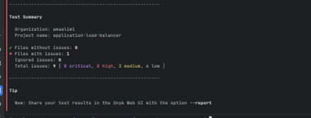

# DevSecOps with Snyk and PyGoat

---

## Introduction

In this Project, I analyzed a vulnerable Django application (PyGoat) for security risks using **Snyk**. The goal was to understand how to scan and fix issues using both the **Snyk CLI** and the **PyCharm plugin**, review and improve code security and quality, practice scanning Infrastructure-as-Code (IaC) files, and demonstrate use of Snyk Advisor and monitoring features.  

Snyk is a developer-first security platform that identifies and fixes vulnerabilities in application dependencies, source code, container images, and Infrastructure as Code (IaC). It plugs into IDEs, CLIs, and CI/CD so security happens continuously and early.  

This Project integrated Snyk with the intentionally vulnerable Django app PyGoat to:

- Scan dependencies with the PyCharm plugin and CLI.  
- Enable Code Security/Code Quality checks.  
- Remediate vulnerable packages and re-scan.  
- Monitor the project over time.  
- Scan IaC templates for misconfigurations.  
- Use Snyk Advisor for container image insights.  
- Understand how Snyk integrates with GitHub for automated fixes.  

---

## ⚙️ Steps Performed

### 1. Clone PyGoat Repository
Cloned PyGoat locally to analyze the real project dependencies.  

---

### 2. Open Project in PyCharm
Verified the project runs as described in the PyGoat docs.  

---

### 3. Authenticate Snyk CLI
Authenticated local environment with Snyk using `snyk auth`.  

---

### 4. Initial Scan with PyCharm Plugin
Performed initial dependency scans inside PyCharm.  

---

### 5. Enable Code Security & Code Quality
Enabled Snyk Code to catch issues in custom code and highlight maintainability problems.  

---

### 6. Re-run Scan After Enabling Features
Confirmed fewer issues after enabling security/quality features.  
  

---

### 7. Run Snyk Test via CLI
Scanned with CLI and documented findings.  

---

### 8. Fix Vulnerable Django Version
Upgraded Django to address the most severe framework vulnerabilities.  
  

---

### 9. Run Snyk Monitor
Used `snyk monitor` to snapshot dependencies for continuous tracking.  
  

---

### 10. Snyk Advisor for Python 3.8
Analyzed the official Python 3.8 image in Snyk Advisor.  

---

### 11. Perform IaC Scan
Ran `snyk iac test` on a CloudFormation template.  
  

---

## 📝 Findings and Reflection

**What I found:**  
- Initially 185 dependency vulnerabilities with several critical Django issues (SQLi, DoS, traversal).  
- Other libraries (PyYAML, urllib3, Jinja2, sqlparse) introduced code execution, info-leak, and DoS risks.  
- IaC templates had configuration weaknesses (open security groups, no HTTPS enforcement, public IP exposure, unencrypted volumes).  

**What I fixed:**  
- Upgraded Django to mitigate major framework CVEs.  
- Enabled Code Security/Quality for source analysis.  
- Reduced vulnerabilities from 185 → 31 in plugin view.  
- Confirmed fixes with both IDE and CLI scans.  

**What I learned:**  
- Remediation is incremental,fixing major frameworks removes many high-severity issues, but transitive dependencies remain.  
- Continuous monitoring is essential since new CVEs emerge even without code changes.  
- Security spans across code, dependencies, containers, and IaC.  
- Automated GitHub PRs from Snyk accelerate patching.  

---

---

